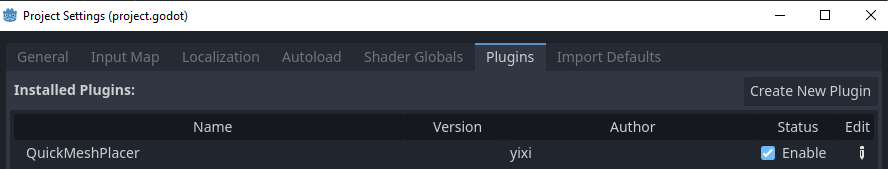
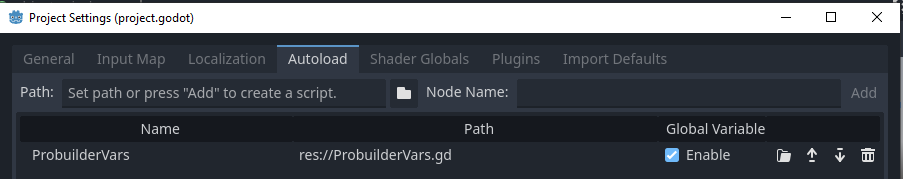
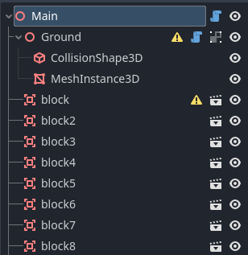
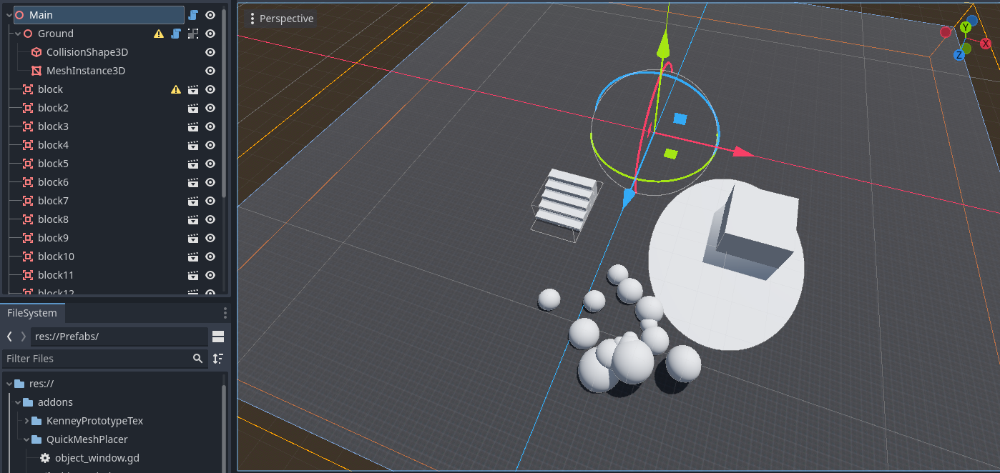
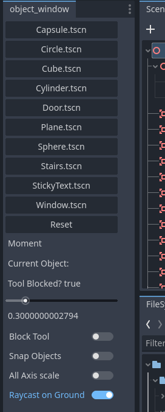
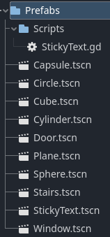
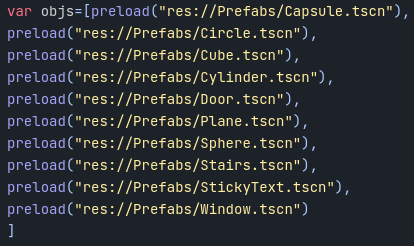

# GodotProbuild
A quick test to create a level design tool in godot

## Showcase
<video controls>
  <source src="ReadMeStuff/GodotProbuild.mp4" type="video/mp4">
  Your browser does not support the video tag.
</video>

## How does it work?
This Plugin was made in one and a half days, as a tool for a university course. 
So bugs can happen!
### Enable Plugin 
First please check, if the plugin QuickMeshPlacer is enabled under Project>Project Settings> Under the Plugin Tab

The Singleton/Autoload ProbuilderVars also needs to be enabled
Project>Project Settings> Under the Autoload Tab

### Structure

Everything is placed under an Main Node and there is also a ground with an Mesh of a Plane and a CollisionShape.

Select either the Main Node or the Ground Node and u can directly place Objects.
The blue script indicates an tool script. This tool script locks the Transform of Main and Ground so it won't move during your blockout

The dock on the left is the toolsettings.

By clicking on the buttons e.g Cube.tscn you are selecting the Cube Prefab.
and by clicking on the ground plane, you are already placing objects.

The process is in 3 clicks. 
- The first click sets the position of the object. 
- The second click sets the x and z scale.
- The third click sets the y scale.

The slider is setting a factor to increase the scaling speed.
(The value stands directly under the slider)

The checkboxes are setting some modes for the tool.
- Block Tool: blocks the tool overall, so that you can use the default gizmos
- Snap objects: Instead of having position or scale values of 1.112312345, it rounds the values. So it's just 1 etc.
- All Axis scale: The default mode is, that the scaling in all three axes are "custom". if this option is true, the scaling is the same on all three axes.
- Raycast on Ground: Per default the raycast e.g the position of spawning of the objects is set on the Ground plane. If false, you can place objects on objects.

### Adding more Prefabs
Project Structure:
- res
    - addon
    - Prefabs
        - Scripts

The tscn (Scene) files in this directory corresponds to the amount of buttons in the Tool dock!

After adding a new Scene, you need to go into the ProbuilderVars.tscn file and add another preload to the objs list 

At last you need to reload the Singleton/Autoload under Project>ProjectSettings> Autoload Tab. (Disable and Enable again)
Now there should be a new Button visible in the dock!

### Dev Stuff
- Some Stuff this projects/tool is using 
- Ray casting from mouse into the scene. 
- Custom dock  (object_window)
- Custom Nodes (PrefBtn)
- Custom signals/events (see ProbuilderVars)
- Mouse Input in Editor (_forward_3d_gui_input)
- Singleton/Autoload
- persistent adding of Nodes into the scene hierachy

